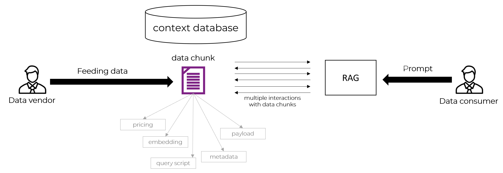

<div align="center">
  <a href="https://www.embedelite.com/">
    
  </a> 
</div>

<p align="center">
    Relevant LLM-ready assets for professionals. <br/>

<br>

# SK Hackathon EmbedElite Plugin

This project is creating a plugin for the EmbedElite marketplace for the SK Hackathon. The plugin facilitates fetching ready-made premium embeddings via an API.

# About EmbedElite

EmbedElite is a marketplace for LLM assets, i.e., data chunks, priced by demand and queried via Retrieval-Augmented Generation (“RAG”)
On one side, data vendors feed information onto the platform and are compensated per usage of their data and retrieval algorithm
On the other side, data consumers perform queries enriched by the relevant assets and algorithms, paying per query and tokens retrieved



# How to Use EmbedElite

### Endpoints for Data Consumers

#### Request Type: POST

URL:

```http request
https://api.embedelite.com/query
```

Headers:

```http request
API-Key: <YOUR_API_KEY>
Content-Type: application/json
```

Body (JSON):

```json
{
  "query": "<your_query_to_make>",
  "product_id": "<the_product_id>",
  "rag_id": "<the_rag_id>",
  "price_floor": 1.0,
  "price_cap": 5.0,
  "currency": "EUR"
}
```
cUrl example:
```bash
curl -X POST https://api.embedelite.com/query \
-H "API-Key: sk-ee-9m839d3n98nh39fh9f3mhe98h3" \
-H "Content-Type: application/json" \
-d '{
  "query": "How much does GitHub Copilot cost?",
  "product_id": "PRODUCT_sdlkj343k9u34x9f9",
  "rag_id": "RAG_aks298msd9nj34hncs",
  "price_floor": 1.0,
  "price_cap": 5.0,
  "currency": "EUR"
}'
```

Response Example:
```json
{
  "response": "GitHub Copilot costs $100.00/year.",
  "currency": "EUR",
  "paid": 2.3,
  "originalQuery": "How much does GitHub Copilot cost?",
  "price_cap": 2.3,
  "price_floor": 2.3,
}
```

## For Vendors

Data vendors can simple push content via a POST endpoint to the platform. EmbedElite will keep the data confidential and intellectual ownership stays with the vendor. The ownership is defined in the metadata field. If you are a data vendor, please contact us for the data vendor API access: info@embedelite.com.
